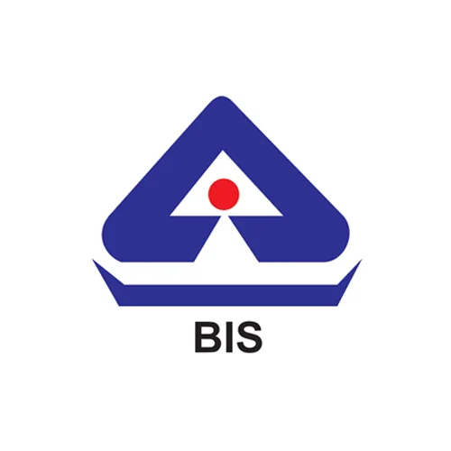

#   BIS AI — Bureau of Indian Standards

> AI-powered product safety verification platform with offline-first design for rural India.

   

---

## 📋 Table of Contents

- [Overview](#overview)
- [Architecture](#architecture)
- [Tech Stack & Pipeline](#tech-stack--pipeline)
- [Features](#features)
- [Project Structure](#project-structure)
- [Setup & Installation](#setup--installation)
- [Environment Variables](#environment-variables)
- [Deployment](#deployment)

---

## Overview

BIS AI helps Indian consumers verify product safety, check BIS/ISI certifications, and access safety standards — even without internet connectivity. Built for the **Smart India Hackathon**, it prioritizes accessibility for rural users on low-bandwidth connections.

---

## Architecture

```
┌─────────────────────────────────────────────────┐
│                   Frontend (PWA)                │
│  React 18 + TypeScript + Vite + Tailwind CSS    │
│  ┌───────────┐ ┌──────────┐ ┌────────────────┐  │
│  │  Pages    │ │Components│ │  Offline Data  │  │
│  │ BISHome   │ │ Hero     │ │ Knowledge Base │  │
│  │ BISChat   │ │ Scanner  │ │ 9 Languages    │  │
│  │ Standards │ │ Alerts   │ │ Service Worker │  │
│  └───────────┘ └──────────┘ └────────────────┘  │
└────────────────────┬────────────────────────────┘
                     │ HTTPS / REST
┌────────────────────▼────────────────────────────┐
│              Backend (Supabase)                 │
│          Supabase (PostgreSQL + Auth)           │
│  ┌─────────────────────────────────────────┐    │
│  │         Edge Functions (Deno)           │    │
│  │  • safety-assistant    (AI chat)        │    │
│  │  • bis-chat            (BIS Q&A)        │    │
│  │  • analyze-product-image (vision AI)    │    │
│  │  • home-safety-report  (PDF reports)    │    │
│  └──────────────┬──────────────────────────┘    │
│                 │                               │
│  ┌──────────────▼──────────────────────────┐    │
│  │    Google Gemini API                    │    │
│  │    Gemini 2.5 Flash                     │    │
│  └─────────────────────────────────────────┘    │
│                                                 │
│  ┌─────────────────────────────────────────┐    │
│  │  Database Tables                        │    │
│  │  • product_reports    • safety_alerts   │    │
│  │  • product_reviews    • scan_history    │    │
│  └─────────────────────────────────────────┘    │
└─────────────────────────────────────────────────┘
```

---

## Tech Stack & Pipeline

### Frontend Pipeline

| Layer           | Technology                          |
|-----------------|-------------------------------------|
| **Build Tool**  | Vite 5 (ESBuild + Rollup)           |
| **Framework**   | React 18 with SWC compiler          |
| **Language**    | TypeScript 5                        |
| **Styling**     | Tailwind CSS 3 + shadcn/ui          |
| **Routing**     | React Router DOM v6                 |
| **State**       | TanStack React Query v5             |
| **Animations**  | Framer Motion                       |
| **Forms**       | React Hook Form + Zod validation    |
| **Charts**      | Recharts                            |
| **Markdown**    | react-markdown + remark-gfm         |
| **PDF**         | jsPDF                               |
| **PWA**         | vite-plugin-pwa (Workbox)           |

### Backend Pipeline

| Layer               | Technology                        |
|---------------------|-----------------------------------|
| **Platform**        | Supabase                          |
| **Database**        | PostgreSQL with Row-Level Security|
| **Edge Functions**  | Deno (TypeScript)                 |
| **AI Model**        | Google Gemini 1.5 Flash           |
| **Auth**            | Supabase Auth + OAuth             |
| **File Storage**    | Supabase Storage                  |

### RAG Pipeline (Retrieval-Augmented Generation)

| Stage | Name         | What Happens                                                                                          |
|-------|--------------|-------------------------------------------------------------------------------------------------------|
| 1     | **Ingest**   | Recursively crawl all pages across bis.gov.in — standards, certification, labs, publications, news, FAQs, consumer programmes |
| 2     | **Chunk**    | Split content into ~500-token overlapping passages; preserve headings and structural units             |
| 3     | **Embed**    | Convert chunks to 768-dimensional vectors using Gemini `text-embedding-004` model                     |
| 4     | **Store**    | Index vectors + metadata (URL, title, content type, timestamp) in PostgreSQL with pgvector extension  |
| 5     | **Retrieve** | Hybrid search combining Full-Text Search (FTS) + semantic search with RRF (Reciprocal Rank Fusion)   |
| 6     | **Answer**   | Pass retrieved context to Gemini 2.5 Flash with grounding prompt; stream the response to the UI      |

#### Hybrid Search with RRF Fusion

The system uses a sophisticated hybrid retrieval approach:

- **Full-Text Search (FTS)**: PostgreSQL's built-in text search for exact keyword matching
- **Semantic Search**: pgvector with cosine similarity for conceptual matching
- **RRF Fusion**: Combines both rankings using `score = 1/(k + rank_position)` formula
- **Benefits**: Better recall (semantic) + better precision (FTS) = optimal results
- **Fallback**: Gracefully falls back to FTS-only if embedding generation fails

See [supabase/HYBRID_SEARCH.md](supabase/HYBRID_SEARCH.md) for detailed documentation.

---

## Features

### 🤖 AI-Powered Safety Assistant
- Real-time streaming AI responses via Gemini 2.5 Flash
- Product safety guides with certification checks
- Quick-search prompts for common products

### 📸 Product Image Scanner
- Upload product photos for AI vision analysis
- Detects ISI/BIS marks, brand, certification numbers
- Risk level assessment (low/medium/high)

### 📴 Offline-First (PWA)
- Full Progressive Web App with service worker caching
- Offline knowledge base with BIS standards and safety info
- Voice input search (Web Speech API) when offline
- Automatic online/offline detection with UI switching

### 🌐 Multilingual Support (9 Languages)
- English, Hindi, Urdu, Tamil, Telugu, Bengali, Kannada, Malayalam, Kashmiri
- Offline-available translations for all safety content

### ⚡ Low Bandwidth Mode
- Auto-detects 2G/slow-2G connections
- Disables animations, heavy graphics, backdrop filters
- Text-focused minimal UI for slow devices
- Manual toggle via ⚡ icon in header

### 📊 Additional Features
- Product comparison tool
- Community trust scores & reviews
- Safety alerts dashboard
- Market risk map
- Household safety scanner
- Report counterfeit products
- BIS certification guide
- Standards explorer

---

## Project Structure

```
├── public/                     # Static assets, PWA icons
├── src/
│   ├── assets/                 # Images (Ashoka Chakra, etc.)
│   ├── components/             # React components
│   │   ├── ui/                 # shadcn/ui primitives
│   │   ├── Header.tsx          # Main navigation
│   │   ├── Hero.tsx            # Landing hero (low-bandwidth aware)
│   │   ├── SmartSafetyAssistant.tsx  # AI chat (online/offline)
│   │   ├── OfflineSafetyAssistant.tsx # Offline search + voice
│   │   ├── HouseholdScanner.tsx      # Image analysis
│   │   ├── LowBandwidthToggle.tsx    # ⚡ toggle
│   │   └── ...
│   ├── data/
│   │   ├── products.ts                    # Product database
│   │   ├── offlineKnowledgeBase.ts        # Offline BIS data
│   │   └── offlineKnowledgeMultilingual.ts # 9-language translations
│   ├── hooks/
│   │   ├── useOnlineStatus.ts   # Network detection
│   │   ├── useLowBandwidth.tsx  # Bandwidth context provider
│   │   ├── useAuth.tsx          # Authentication
│   │   └── use-mobile.tsx       # Responsive detection
│   ├── integrations/
│   │   └── supabase/            # Auto-generated client & types
│   ├── pages/
│   │   ├── BISHome.tsx          # Main landing page
│   │   ├── BISChat.tsx          # AI chat page
│   │   ├── CertificationGuide.tsx
│   │   ├── StandardsExplorer.tsx
│   │   └── AboutBIS.tsx
│   ├── App.tsx                  # Root with providers
│   ├── main.tsx                 # Entry point
│   └── index.css                # Design tokens & Tailwind
├── supabase/
│   ├── functions/
│   │   ├── safety-assistant/    # AI streaming chat
│   │   ├── bis-chat/            # BIS Q&A
│   │   ├── analyze-product-image/ # Vision AI scanner
│   │   └── home-safety-report/  # PDF generation
│   └── config.toml              # Supabase configuration
├── vite.config.ts               # Vite + PWA config
├── tailwind.config.ts           # Design system tokens
└── package.json
```

---

## Setup & Installation

### Prerequisites
- Node.js 18+ (recommended: use [nvm](https://github.com/nvm-sh/nvm))
- npm or bun

### Local Development

```bash
# 1. Clone the repository
git clone <YOUR_GIT_URL>
cd <YOUR_PROJECT_NAME>

# 2. Install dependencies
npm install

# 3. Start development server
npm run dev
# App runs at http://localhost:8080
```

### Available Scripts

| Command          | Description                        |
|------------------|------------------------------------|
| `npm run dev`    | Start dev server (port 8080)       |
| `npm run build`  | Production build                   |
| `npm run preview`| Preview production build           |
| `npm run lint`   | Run ESLint                         |
| `npm run test`   | Run tests (Vitest)                 |
| `npm run test:watch` | Run tests in watch mode        |

---

## Environment Variables

The following environment variables are required:

### Frontend (.env.local)
| Variable                          | Description              |
|-----------------------------------|--------------------------|
| `VITE_SUPABASE_URL`              | Backend API URL          |
| `VITE_SUPABASE_PUBLISHABLE_KEY`  | Public API key           |
| `VITE_SUPABASE_PROJECT_ID`       | Project identifier       |

### Backend (Supabase Edge Functions)
Set these in Supabase Dashboard → Project Settings → Edge Functions → Secrets:

| Variable                | Description                                      | Get it from                          |
|-------------------------|--------------------------------------------------|--------------------------------------|
| `GEMINI_API_KEY`        | Google Gemini API key for AI responses           | https://aistudio.google.com/apikey   |
| `FIRECRAWL_API_KEY`     | Firecrawl API key for crawling BIS website       | https://firecrawl.dev                |

### Setting up Firecrawl

1. **Get Firecrawl API Key:**
   - Visit https://firecrawl.dev
   - Sign up for a free account
   - Copy your API key from the dashboard

2. **Add to Supabase:**
   - Go to https://supabase.com/dashboard/project/YOUR_PROJECT_ID/settings/functions
   - Click "Add new secret"
   - Name: `FIRECRAWL_API_KEY`
   - Value: Your Firecrawl API key
   - Click "Save"

3. **Crawl BIS Website:**
   - Navigate to `/admin-crawl` in your app
   - Click "Start Crawl & Ingest"
   - This will scrape 50+ BIS pages and populate the knowledge base
   - Takes ~5-10 minutes depending on rate limits

4. **What gets crawled:**
   - BIS certification schemes (ISI Mark, Hallmarking, CRS, FMCS)
   - Product standards across all categories
   - Consumer affairs and complaint procedures
   - Laboratory services and testing
   - About BIS organization and structure

---

## Deployment

### Manual Deployment
1. Set up a Supabase project at [supabase.com](https://supabase.com)
2. Configure environment variables in your deployment platform
3. Deploy edge functions using Supabase CLI
4. Build and deploy the frontend
2. Click **Share → Publish**
3. Optionally connect a custom domain via **Settings → Domains**

### PWA Installation
Once published, users can install the app on mobile/desktop:
- **Android**: "Add to Home Screen" prompt
- **iOS**: Safari → Share → "Add to Home Screen"
- **Desktop**: Chrome address bar install icon

---

## License

Built for Smart India Hackathon. All BIS standards referenced are property of the Bureau of Indian Standards, Government of India.

